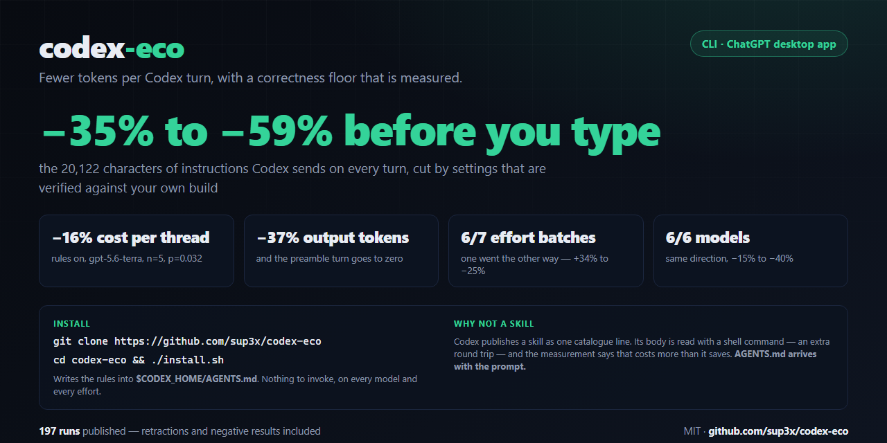
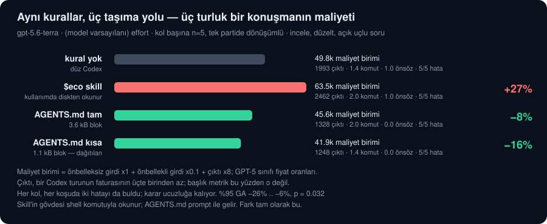
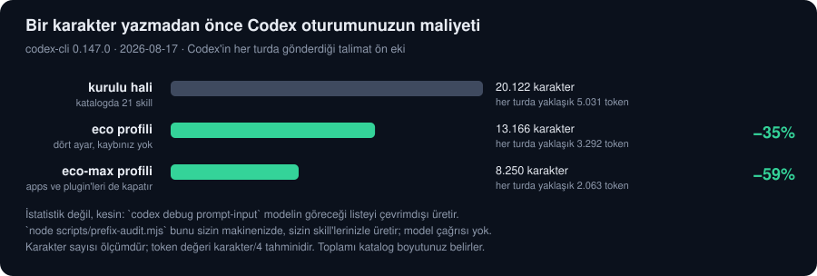
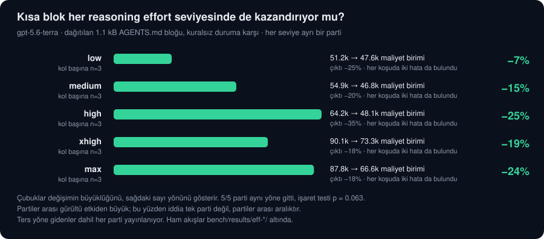

# codex-eco — Codex için eco modu

**Codex oturumun sen tek harf yazmadan önce zaten ~5.000 token'a mal oluyor. `codex-eco` bunu bedava ve çevrimdışı bir denetimle ölçer, kendi Codex sürümünde doğrulanmış ayarlarla üçte birini keser, ve davranış kurallarını taşıması hiçbir şeye mal olmayan tek kanaldan kurar — bariz görünen kanalın yanlış olduğunu söyleyen ölçümler dahil.**

**Codex CLI** ve **ChatGPT masaüstü uygulamasındaki Codex** için çalışır. Tek kurulum ikisini de kapsar.

[English](README.md) · [Türkçe](README.tr.md)

[](LICENSE) [](https://developers.openai.com/codex) [](#buradaki-her-iddia-nasıl-doğrulandı)



## Hızlı başlangıç

```bash
git clone https://github.com/sup3x/codex-eco && cd codex-eco && ./install.sh
```

Windows: `.\install.ps1`.

Kurulum bu kadar. **Çağıracağın bir şey yok** — kurallar `$CODEX_HOME/AGENTS.md` dosyasına yazılır, Codex de onu her turda, her reasoning effort seviyesinde, her modelde, hem CLI'da hem masaüstü uygulamasında prompt'un içine yükler. Yeni bir oturum aç, açıktır.

```
$ ./install.sh
codex-eco
  rules:      /home/sen/.codex/AGENTS.md (global, short block)
  skills dir: /home/sen/.agents/skills (default)
  rules: block appended to /home/sen/.codex/AGENTS.md (short; previous file at .../.eco-backups/AGENTS.md-20260817-135234)
  eco: installed and verified (3 files)
  eco-max: installed and verified (2 files)
```

Blok `<!-- codex-eco:start -->` / `<!-- codex-eco:end -->` ile sınırlı: tekrar çalıştırınca ikinci bir kopya eklemek yerine yerinde değiştirir, `--uninstall` tam olarak o bloğu siler ve dosyanın kalanına dokunmaz, değişecek her dosya önce `.eco-backups/` altına kopyalanır. İki kurucu bayt bayt aynı dosyayı üretir.

| | Ne yapar | Ne zaman |
|---|---|---|
| `./install.sh` | kuralları global olarak + iki skill | varsayılan |
| `./install.sh --project` | kuralları bu deponun `AGENTS.md`'sine | proje bazında istiyorsan, ya da paylaştığın bir depoda |
| `./install.sh --full` | 1.1 kB yerine tam 3.6 kB'lık kural bloğu | en ucuz blok yerine her kuralı istiyorsan |
| `./install.sh --rules-only` / `--skills-only` | yalnız bir yarısı | sadece birini istiyorsan |
| `./install.sh --uninstall` | bloğu ve skill'leri kaldırır | |

Skill'ler, kurallar dosyasının yapamadığı iki iş için duruyor:

| | Codex CLI | ChatGPT masaüstündeki Codex |
|---|---|---|
| Kurulumunu ayarla | `$eco setup` | `@eco setup` |
| Modu tek bir konuşmada aç | `$eco <görev>` | `@eco <görev>` |

Bir skill çağırmak fazladan bir shell turuna mal olur; buna güvenmeden önce nedenini bilmek işine yarar — [kuralların neden skill'de olmadığı](#kurallar-neden-agentsmdde-skillde-değil).

## Kurallar neden AGENTS.md'de, skill'de değil

Bu projenin ana bulgusu bu, ve öğrenmesi bir geri çekmeye mal oldu.


Codex bir skill'i modele **tek bir katalog satırı** olarak yayınlar — ad, açıklama ve bir yol:

```
- eco: Token-frugal mode for Codex - fewer tokens per turn ... (file: ~/.agents/skills/eco/SKILL.md)
```

Gövde prompt'ta değildir. Bunu tek token harcamadan kendin görebilirsin, çünkü `codex debug prompt-input` modelin göreceği listeyi çevrimdışı üretir:

```bash
codex debug prompt-input '$eco src/app.ts dosyasını incele' > ile.json
codex debug prompt-input 'src/app.ts dosyasını incele'      > olmadan.json
diff ile.json olmadan.json      # aradaki fark beş bayt: düz metin "$eco "
```

Bundan üç sonuç çıkar ve üçü de ölçülebilir:

1. **Kurallar ancak ajan dosyayı okuduktan sonra geçerli olur.** O okuma bir shell komutudur — tam bir fazladan tur, ve her tur bütün ön eki yeniden gönderir. `gpt-5.6-terra` üzerinde ölçüldü: `$eco` çağırmak tek turluk bir işte önbellekli girdiyi 28,2k'dan 43,7k token'a çıkardı.
2. **En büyük etkisi ölçülen kural bir skill üzerinden hiç çalışamaz.** "İlk çıktın bir araç çağrısıdır, duyuru değil" kuralı, gövde okunmadan **önce** ihlal edilir: model bir skill'i çağırmaya karar verdiği anda elinde yalnızca açıklama vardır. 5/5 koşuda modu duyurdu, sonra bunu yasaklayan kuralı okudu. Bunu hiçbir ifade düzeltmez; sorun çağırma sırasıdır.
3. **Gövdenin okunup okunmayacağı bir model kararıdır, garanti değil.** Bu projenin kaydettiği bütün koşular `SKILL.md`'ye dokunan bir komut için yeniden taranınca bazı partilerde 10/10, **bazılarında 1/20** okuma çıktı. Yani iki çalışma bir temeli kendisiyle karşılaştırmış; sonuçları sessizce silinmek yerine `bench/preregistration/001-first-study.md` içinde geri çekildi.

`AGENTS.md`'de bu sorunların hiçbiri yok. Codex onu `<INSTRUCTIONS>` içinde aynen enjekte eder; ne fazladan tur, ne verilecek bir karar — aynı bedava çevrimdışı yolla, dosyaya bir işaret metni koyup üretilen prompt'ta bularak doğrulandı. Kurucunun ilk işi bu yüzden bloğu yazmak, skill de bu yüzden ikincil yol olarak belgeleniyor.

**Skill hâlâ ne için var.** `$eco setup` — yapılandırmanı okuyup kaldıraçları önermek, onay almadan hiçbir şey uygulamamak — fazladan bir turun önemsiz olduğu tek seferlik bir iş. Ve konuşmanın ortasında `$eco` çağırmak, `AGENTS.md`'sini senin kontrol etmediğin bir depoda disiplini açmanın tek yolu.

## İki maliyet, ve yalnız birinin istatistiğe ihtiyacı var

Bu ikisini ayrı tutmak, dürüst bir iddia ile pazarlama sayısı arasındaki farktır:

| | Nasıl ölçülüyor | Ne kadar kararlı |
|---|---|---|
| **Sabit ön ek** — skill kataloğu, plugin reklamı, sen yazmadan gönderilen talimat metni | `codex debug prompt-input`, çevrimdışı, model çağrısı yok | Kesin. İki kez çalıştır, aynı baytları al. Tam karakter sayısı olarak veriliyor. |
| **Kuralların davranışa etkisi** | Canlı model, kol başına n=5, kollar tek parti içinde dönüşümlü, deterministik notlama | Gürültülü. Bu işte tek parti bir yönü belirlemez; ölçüt yönün bağımsız partilerde tekrar etmesi, yayınlanan etki de bir aralık. |

Denetim, kendi makinende bir saniyede doğrulayabildiğin kısım. Davranış sayıları ise bu deponun uzun uzun, açıkça — aleyhimize çıktığı yerler dahil — tartıştığı kısım.

## Token'ının nereye gittiğini gör — hiç harcamadan

Bu depodaki en faydalı şey çalıştırmak bedava ve hiçbir model çağrısı yapmıyor:


```bash
node scripts/prefix-audit.mjs
```

```
section                           chars   ~tokens
-------------------------------------------------
skills catalog                   16,901     4,225
recommended-plugins advert        2,849       712
core instruction prose            2,269       567
multi-agent mode note               271        68
-------------------------------------------------
TOTAL before you type            22,290     5,573

configuration                     chars   ~tokens      change
-------------------------------------------------------------
as configured now                22,290     5,573           -
eco profile (safe)               14,684     3,671      -34.1%
eco profile (aggressive)          9,768     2,442      -56.2%
```

Bunlar tek bir makineden gelen gerçek sayılar; `codex debug prompt-input` üretiyor, yani Codex'in göndereceği tam öğe listesi. Kendi projende çalıştırırsan kendi sayılarını görürsün — `AGENTS.md` dosyanın maliyeti dahil. Denetimin önerdiği her anahtar, önerilmeden önce `codex mcp-server --strict-config` ile senin Codex sürümüne karşı doğrulanır; böylece bir yazım hatası asla tasarruf gibi görünemez.

## Ne alıyorsun

| Parça | Ne yapar |
|---|---|
| **`AGENTS.eco.lean.md`** | Kurucunun varsayılan olarak yazdığı kural bloğu: 1.1 kB, ölçülen etkiyi taşıyan satırlara elle indirilmiş. `AGENTS.md` her istekte yeniden gönderildiği için bu dosyanın boyutu tur başına bir maliyet — 1.600 baytı geçerse CI hata veriyor. |
| **`AGENTS.eco.md`** | Tam kural bloğu, 3.6 kB, `eco` skill gövdesinden üretiliyor; ikisi birbirinden ayrışamıyor. `./install.sh --full` bunu kurar. |
| **`eco` skill'i** | `$eco setup` yapılandırmanı okur, kaldıraçları önerir, onay almadan hiçbir şey uygulamaz. `$eco <görev>` disiplini tek bir konuşmada açar — bir tur bedeliyle. |
| **`eco-max` skill'i** | Aynı kurallar, en sıkı cevap bütçesiyle; rutin işler için. `eco`'dan üretiliyor. |
| **`profiles/eco.config.toml`** | Güvenli ön ek katmanı: doğrulanmış dört ayar ve iki sınır. `codex --profile eco`. |
| **`profiles/eco-max.config.toml`** | Reasoning effort tabanı ve agresif ön ek katmanını ekler. |
| **`scripts/prefix-audit.mjs`** | Aşağıdaki bedava, çevrimdışı denetim. Önerdiği her anahtarı, önermeden önce kendi Codex sürümünde doğrular. |
| **`scripts/cost-report.mjs`** | Kayıtlı herhangi bir partiyi, yalnız çıktı token'ı değil, bir turun gerçekte ne faturalandırdığı üzerinden yeniden puanlar. |
| **`bench/`** | Koşucu, deterministik notlayıcı, köken dosyası ve ön kayıtlar — geri çekmeler dahil. |

## Ölçülen sonuçlar

<!-- codex-eco:results:start -->
### 1. Sabit ön ek — kesin, istatistik yok

codex-cli 0.147.0 ile, katalogda 21 skill varken, sen yazmadan önce gönderilen talimat ön eki **20.122 karakter** (~5.031 token). Güvenli profil bunu **13.166** karaktere (**-34.6%**), agresif profil **8.250** karaktere (**-59.0%**) indiriyor. Kendi makinende bir komutla doğrula: `node scripts/prefix-audit.mjs`.

### 2. Kuralları taşımanın üç yolu

`gpt-5.6-terra`, model varsayılanı effort, kol başına n=5, kollar tek parti içinde dönüşümlü. Her koşu üç turluk tek bir konuşma: incele, düzelt, açık uçlu soru. Kullanım tüm konuşma boyunca toplandı.

| Kol | maliyet | temele karşı | çıktı | komut | önsöz | iki hata da |
|---|---:|---:|---:|---:|---:|---|
| `kural yok` | 49.818 | — | 1.993 | 1.4 | 1.00 | 5/5 |
| `$eco skill` | 63.471 | **+27.4%** (%95 GA 19.1% .. 37.7%, p = 0.008) | 2.462 | 2.0 | 1.00 | 5/5 |
| `AGENTS.md tam` | 45.601 | **−8.5%** (%95 GA −18.8% .. 3.7%, p = 0.222) | 1.328 | 2.0 | 0.00 | 5/5 |
| `AGENTS.md kısa` | 41.856 | **−16.0%** (%95 GA −26.1% .. −5.6%, p = 0.032) | 1.248 | 1.4 | 0.00 | 5/5 |

Her kol, her koşuda iki ekili hatayı da buldu; karar bu yüzden ucuzluğa kalıyor. Kısa blok kazanıyor, `$eco` skill'i ise anlamlı biçimde kaybediyor — nedeni [yukarıda](#kurallar-neden-agentsmdde-skillde-değil).

### 3. Her reasoning effort seviyesinde tekrar



Dağıtılan blok, `gpt-5.6-terra` üzerinde 5 bağımsız partide sınandı (kol başına n=3); **5/5 parti aynı yöne** gitti, iki yönlü işaret testi p = 0.063. Etki **-7.0% ile -25.1%** arasında değişti ve iki ekili hata her seviyede, her koşuda bulundu. Yayınlanan sayı bu aralıktır; tek bir parti değil.

Eğilim açık ve mekanizması makul: effort yükseldikçe temel çıktı da uzuyor, yani kesilecek yağ artıyor.
<!-- codex-eco:results:end -->

## Kurallar tam olarak neyi hedefliyor

Her kural, silahsız ajanın gerçek bir transkriptte o şeyi yaptığı **görüldüğü** için var:

1. **Önsöz turu.** Codex, ne yapacağını duyuran bir mesajla başlıyor — *"I'll inspect the test file and its nearby project context, then summarize"* — ve komutu ancak ondan sonra çalıştırıyor. Bu, hiçbir işi ilerletmeyen faturalı bir çıktı ve bu depodaki en güvenilir etki: **blok olmadan koşu başına 1.00 önsöz, blokla 0.00 — ölçülen her partide**. Bu kuralın en iyi ifadesini dört varyantı A/B test ederek seçme girişimi [geri çekildi](bench/preregistration/001-first-study.md) — 20 koşusunun 19'unda kurallar hiç yüklenmemişti — yani dağıtılan ifade, bir karşılaştırmayı kazanan değil, çalıştığı ölçülen ifade.
2. **İstenmeyen keşif.** Tek bir dosyayı incelemesi istenen silahsız ajan, ayrıca `Get-ChildItem -Force` ve ağaç geneli `rg -n "orders" .` çalıştırdı — kimsenin istemediği bir dizin dökümü ve tam ağaç grep'i. Üç turluk konuşmada blok, komut sayısını temelin 1.4 seviyesinde tutarken çıktıyı %37 kesiyor; yani bir maliyeti başkasıyla değişmiyor, israfı kaldırıyor.
3. **Bütün dosyayı dökme.** Codex'te editör aracı yok; her şey bir shell komutu. Bu yüzden kurallar komut hijyeni üzerine: bölgeyi iste (`sed -n`, `Get-Content -TotalCount`), `rg -n`'den önce `rg -l`, bağımsız komutları tek çağrıda birleştir, dosyayı shell'le yeniden yazmak yerine `apply_patch`.
4. **Thread'in büyümesi.** Codex'te modelin kendisinin çağırabildiği bir `new_context` aracı var ve Codex'in kendi rehberi sıkıştırmanın doğruluğa mal olabileceğini söylüyor. Kurallar diyor ki: geçmiş anlamını yitirince yeni bir bağlam başlat, ve thread ortasında model veya efor değiştirme — ölçüldü, bu cache'lenmiş ön-ek oranını 0.95'ten 0.07'ye düşürüyor.

## Ölçümle: **işe yaramayanlar**

Yayınlanmış Codex rehberleri bunların hepsini öneriyor. Codex 0.147'de hiçbiri tasarruf sağlamıyor:

| Öneri | Gerçek |
|---|---|
| `model_reasoning_summary = "none"` | Şu anki her model zaten `none` ile geliyor. Sıfır değişiklik. |
| `model_verbosity = "low"` | `gpt-5.4-mini` hariç her modelde zaten varsayılan. Neredeyse herkes için sıfır değişiklik. |
| `hide_agent_reasoning` / `show_raw_agent_reasoning` | Yalnızca görüntüyle ilgili. Ölçüldü: prompt bayt bayt aynı. |
| `features.token_budget` | Geliştirme aşamasında, ve açmak prompt'a ~1.858 karakter **ekliyor**. |
| `model_supports_reasoning_summaries` | Resmî örnek config'de var; kurulu binary **bilinmeyen alan diye reddediyor**. |
| `minimal` akıl yürütme eforu | CLI her string'i sessizce kabul ediyor; bazı güncel modeller `minimal`'ı istek anında HTTP 400 ile reddediyor. Güvenli taban `low`. |
| Skills bloğunu küçültmek için `model_context_window`'u düşürmek | İşe yarıyor (100k'da −1.883 karakter) ama otomatik sıkıştırma eşiğini de düşürüyor, ve sıkıştırma cache'i tamamen öldürüyor. Net etki negatif. |

Bu tablo, projenin neden bu biçimde var olduğunun cevabı: Codex'te frugal *görünen* ama ölçüldüğünde olmayan bir yapılandırma yayınlamak çok kolay.

## Buradaki her iddia nasıl doğrulandı

- **Depoyu Codex'in kendi doğrulayıcıları geçiriyor.** Codex 0.147, `skill-creator` ve `plugin-creator`'ı diskte sistem skill'i olarak, çalıştırılabilir doğrulayıcılarla getiriyor. `plugins/eco/skills/*` `quick_validate.py`'den, `plugins/eco` `validate_plugin.py`'den geçiyor. Claude Code portundan kopyalanan `argument-hint`'in Codex'te hiç var olmadığını da böyle öğrendik.
- **Prompt boyutları tahmin değil, `codex debug prompt-input` çıktısı.** Karakter sayıları kesin; token sayıları `~` işaretli, çünkü karakter/4.
- **Config anahtarları önerilmeden önce `codex mcp-server --strict-config` ile doğrulanıyor.** Codex bilinmeyen anahtarları sessizce yok sayıyor, yani bir ayarın gerçek olduğunu anlamanın tek yolu bu.
- **Kalite deterministik notlanıyor.** `bench/lib/grade.mjs` her cevabı planlanmış hatalara karşı, döngüde model olmadan puanlıyor. Kendi ürettiği bir yanlış-negatif ve nasıl yakalandığı da belgeli — [ön-kayıttaki](bench/preregistration/001-first-study.md) Amendment 2.
- **Kural değişiklikleri ön-kayıtlı.** Uç noktalar ve eşikler çalıştırmalardan önce yazılıyor, başarısızlıklar başarılarla birlikte yayınlanıyor.
- **Asla dolar rakamı yok.** `codex exec` olay akışında maliyet alanı yok. ChatGPT planında para birimi senin hız sınırın, o yüzden bu proje token raporlar.

## Kurulum, detaylı

### Standalone skill — CLI **ve** masaüstü uygulaması

```bash
./install.sh                 # $HOME/.agents/skills
CODEX_SKILLS_DIR=... ./install.sh
./install.sh --uninstall
```

Codex standalone skill'leri üç kökten, en özelden başlayarak okuyor:

```
$CWD/.agents/skills      # yalnız bu proje
$HOME/.agents/skills     # sen, her yerde
/etc/codex/skills        # tüm makine veya konteyner
```

### Codex plugin'i olarak — CLI, tek komut

```bash
codex plugin marketplace add sup3x/codex-eco
codex plugin add eco@codex-eco
```

**Geri çekilen iddia.** Bu README'nin eski bir sürümü, plugin'in "gövdeyi doğrudan verdiğini" ve bu yüzden çağırmanın daha ucuz olduğunu söylüyordu. Bu yanlış. Plugin kuruluyken prompt üretildiğinde aynı tek katalog satırı görünüyor, gövde görünmüyor — plugin ile kurulu bir skill de tıpkı standalone olan gibi diskten okunuyor. İddianın arkasındaki 35'e karşı 131 token gözlemi tek ve tekrarlanmamış bir koşu çiftiydi; açıklaması ise kontrolü geçemedi.

**İkisini birlikte kurmak, birini kurmaktan kötüdür.** Codex bir skill'i bulduğu her kökü yayınlar; yani standalone kopya ile plugin kopyası aynı ad altında *iki* katalog girdisi olur: her turda iki açıklama da faturalanır ve `$eco` artık tek bir gövdeyi işaret etmez. `node scripts/prefix-audit.mjs` bulduğu mükerrer kayıtları bildiriyor, ölçüm koşucusu da skill adı belirsizse partiyi başlatmayı reddediyor — ki bu kusuru, o ana kadar bu projenin çalıştırdığı her partide bulmuş oldu.

Agresif profilin plugin alt sistemini kapattığını unutma: o profil standalone kurulumla eşleşir, plugin kurulumuyla değil.


### Profiller

```bash
cp profiles/eco.config.toml "$CODEX_HOME/eco.config.toml"    # varsayılan olarak ~/.codex
codex --profile eco
```

Profil açılışta katmanlanır; bu yüzden thread ortasında model/efor değiştirmenin yaptığı gibi cache'lenmiş ön-eki bozmaz, ve kaldırmak tek bir dosyayı silmek demektir.

## Benzer çalışmalar

| Proje | Katman | Dürüst karşılaştırma |
|---|---|---|
| [RTK](https://github.com/rtk-ai/rtk) | Shell çıktısı sıkıştırma proxy'si | Bu alanın devi ve tamamlayıcı: komut çıktısını bağlama girmeden küçültüyor. Codex entegrasyonu en zayıf halkası — Codex'te talimata indirgeniyor — buradaki kuralların doldurduğu boşluk tam olarak bu. |
| token-diet | Kısa-cevap kural seti | Codex desteği iddia ediyor ama sayıları başka bir ajandan taşınmış. Bu proje Codex'in kendisinde ölçüyor; bütün fark bu. |
| [agent-token-saver](https://github.com/Supersynergy/agent-token-saver) | Codex'te kontrollü A/B | Bunu Codex'te ölçen tek önceki çalışma. Atıf veriyoruz ve protokolde geçmeye çalışıyoruz: ön-kayıt, kol başına n, bootstrap GA, kesin Mann-Whitney, deterministik notlama ve yayınlanan negatif sonuçlar. |
| ccusage tarzı panolar | İzleme | Harcamayı sonradan ölçer; hiçbir şeyi azaltmaz. |

## Katkı

En değerli katkı başka modellerden, planlardan ve platformlardan gelen ölçüm sonuçları — özellikle eco'nun kaybettiği sonuçlar. `node bench/bench.mjs ab --task "..." --n 5 --rubric orders-review` her çalıştırmanın olay akışını senin için yazar. [CONTRIBUTING.md](CONTRIBUTING.md).

## Lisans

[MIT](LICENSE) © 2026 Kerim
